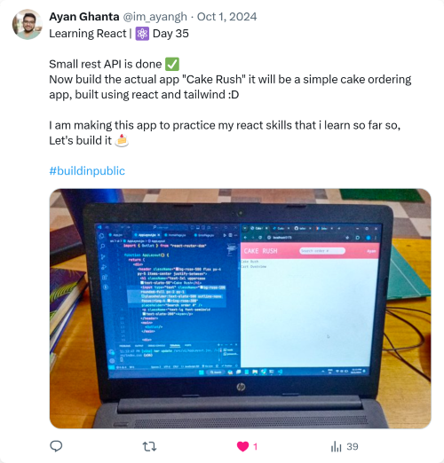

# TweetSnapper: Clean Tweet Screenshots in One Click 📸

**TweetSnapper** is a lightweight Chrome extension that lets you capture clean, clutter-free, high-resolution screenshots of tweets instantly.

> **No cropping. No UI noise. No engagement buttons.**
> Just the tweet beautifully formatted and ready to share.

---

## 🚀 Features

- **📸 Camera Icon on Every Tweet:** A small, unobtrusive capture button appears beside every tweet for quick access.
- **✨ Clean & Minimal Output:** Automatically strips unnecessary UI elements (reply/retweet buttons, analytics, timestamps, bookmarks).
- **🖼️ High-Resolution Exports:** Generates sharp PNG images (HD/2K/4K) perfect for professional use.
- **🎨 Styled Capture Modal:** Previews the tweet in a polished, distraction-free "studio" modal before you save.
- **⚡ One-Click Download:** Instantly saves to your computer, ready for Instagram, LinkedIn, or presentations.
- **💡 Zero Configuration:** No settings to tweak. Just install, hover, and snap.

---

## 📸 Screenshots

## 

## 

## 🧩 How It Works

1.  **Injection:** TweetSnapper injects a small camera icon into the tweet action bar.
2.  **Cloning:** When clicked, the extension clones the specific tweet's DOM elements.
3.  **Cleaning:** It removes noise (engagement stats, reply bars) and applies custom CSS for a "studio look."
4.  **Rendering:** The cleaned HTML is rendered into a canvas using `html-to-image`.
5.  **Export:** The canvas is converted to a high-quality PNG and downloaded to your device.

---

## 🛠️ Tech Stack

- **Core:** Vanilla JavaScript (ES6+)
- **Platform:** Chrome Extensions API (Manifest V3)
- **Rendering:** `html-to-image` (for DOM to PNG conversion)
- **Styling:** CSS3 (Flexbox/Grid for modal layout)

## 📜 License

- **MIT** License — free to use, modify, and distribute.
